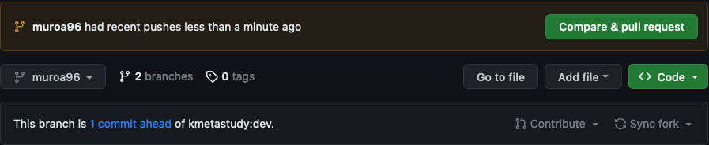

## Courseware

### 작업환경 설정

가상환경 생성

```cmd
python -m venv myvenv
cd courseware
pip install -r requirements.txt
```

노드 모듈 설치

```cmd
npm install
```

### 프로젝트 실행

```cmd
python3 manage.py runserver
```

```cmd
npm run dev
```

### PR 작성규칙

1. `dev` 브랜치를 기준으로 로컬 브랜치를 만듭니다.

[your-own-branch-name]부분에 원하는 이름을 넣으세요. 대괄호( [ ] )는 없어야 합니다.
```
/dev/> git pull origin dev
/dev/> git switch -c "[your-own-branch-name]"
```

2. 작업이 끝나시면, 해당 브랜치를 `push`합니다.
```
/your-own-branch-name/> git add .
/your-own-branch-name/> git commit -m "your commit message"
/your-own-branch-name/> git push origin [your-own-branch-name]
```

3. github에서 `New Pull Request`를 하세요.
`push`가 끝나신 경우, 다음과 같이 PR을 보내라는 메세지가 생성됩니다.


해당 메시지를 클릭하신 후, 다음과 같이 repository를 설정합니다.


> base repository: kmetastudy/courseware > dev   
> compare repository: your-repository > [your-own-branch-name]

### 주의사항
항상 동기화를 생각해주세요.