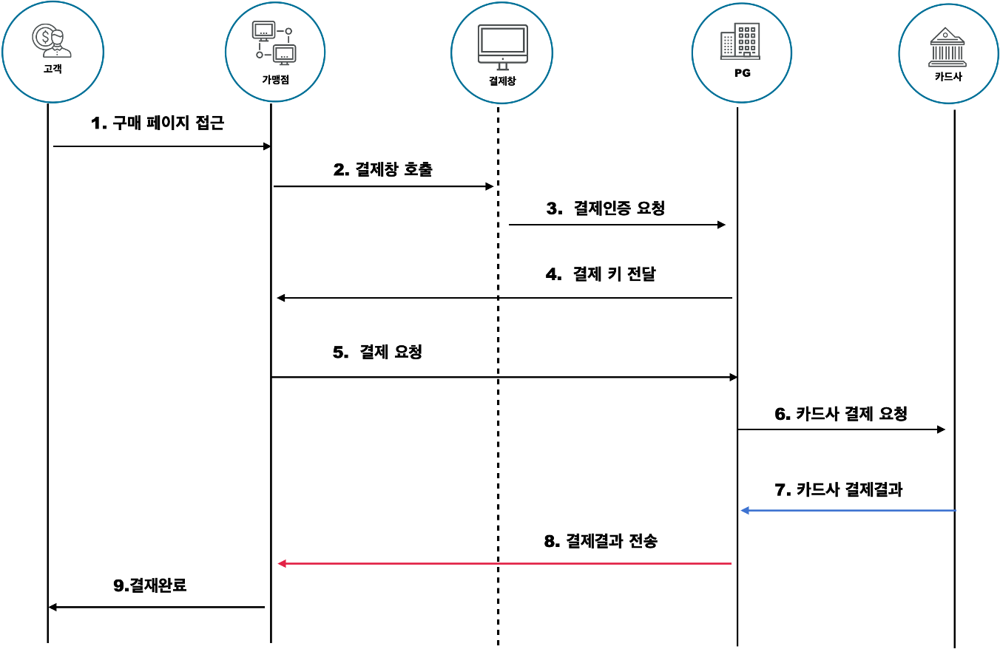

<!-- PortOne -->

# 결제수단
**일반 결제**, **간편 결제**, 정기결제, 본인인증

# 포트원 통해 PG사와 계약
https://guide.portone.io/pgcontract

# 수수료
https://guide.portone.io/fee

# 포트원 연동하는 법 가이드(개발)
https://developers.portone.io/docs/ko/readme?v=v1

## 인증결제(전통) --> 간편결제(최근)

인증결제는 인증방법에 따라 전통적으로 아래 두가지 형태 구분됩니다.
ISP 결제 : 공개키 기반의 전자인증서를 통해 사전에 등록된 카드정보를 인증하는 방식
MPI 결제 : 카드번호, CVC, 안심클릭 비밀번호를 입력하여 카드정보를 인증하는 방식

### 핵심 파라미터
- **IMP.init(가맹점식별코드)** : 테스트 코드는("iamport")
- pg(문자열) : PG사. 미지정 시 아임포트 관리자에서 지정한 기본PG 호출
- pay_method(문자열) : 결제수단(default:"card")
- **merchant_uid(필수, 문자열)** : 가맹점에서 고유 결제 식별자(결제 실패하면 같은 결제건이라도 다른 uid를 사용해야함)
- **name(문자열)** : 주문명
- **amount(필수, 숫자)** : 결제금액
- buyer_name(문자열) : 주문자명
- buyer_email(문자열) : 주문자 이메일
- **m_redirect_url(필수, 문자열)** : 결제완료 후에 이동할 주소(hostname을 포함한 절대주소여야합니다.)
    - 스마트폰에서의 결제를 지원하기 위해서는 필수 파라미터
### 코드

### 모델
- Payment : 결제시도 내역
- Order : 주문 건 저장